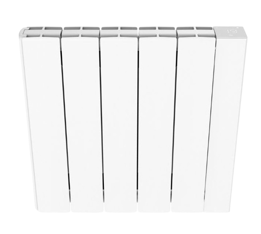

#  MyHeatzy Plugin

The **MyHeatzy** plugin lets you retrieve data from your connected Heatzy devices.

The data is refreshed regularly based on your selected cron frequency (between 5 and 30 minutes).

---

> **Supported Devices**
>
> Only Pilote and Glow models are fully supported at this time (regardless of their version).
> For any unsupported device or if issues occur with supported ones, follow the steps in the [Troubleshooting](#troubleshooting) section.

---

# Configuration

## Plugin Configuration

1. Go to the plugin configuration.
2. Install the dependencies.
3. Start the daemon.

If the daemon doesn’t start, the default port (59769) may already be in use. If so, choose another available port (e.g., 59770), save, and restart the daemon. If the issue persists, refer to the [Troubleshooting](#troubleshooting) section.

You also need to provide (and save):
- Your Heatzy account email.
- Your Heatzy login password.
- Refresh rate: cron 5, 10, 15 or 30 minutes (only one active cron). Keep the daily cron as well.

Once the information is correct, the devices will sync automatically. Close the configuration page. If the equipment does not appear, refresh the page, or check the logs.

## Equipment Configuration

> **REMINDER**
>
> Use the **Synchronize** command to retrieve any new or newly supported devices.

### Heatzy Connected Devices

Clicking on a Heatzy device allows you to access:

- **Device name**: Name assigned in the Heatzy app.
- **Parent object**: To be defined based on your setup.
- **Category**: Choose the appropriate category.

**Commands** tab:
- List of available commands.
- Option to log numerical values.
- Manual refresh available via the **Refresh** command.

On the dashboard, the widget displays the device image, information, and current configuration.

Available modes:
- **Comfort**
- **Eco**
- **Frost protection**
- **Off**

Depending on the device, you can also:
- Enable boost mode
- Enable vacation mode
- Set desired temperature (make sure to switch to Comfort or Eco first)
- Enable/disable scheduling

---

# Managing Scenarios

Make sure to switch the mode to Eco or Comfort before setting a desired temperature in your scenarios! (Only available for some devices.)

---

# Troubleshooting

1. Set **MyHeatzy** logs to **debug** mode.
2. Restart the daemon.
3. Check the logs to identify the issue.

If needed, see the [FAQs](#faqs), and finally [Request Help](#request-help) section.

## FAQs

### Fatal Error: [Errno 98] address already in use

The communication port between Jeedom and the daemon (default: 59769) is already in use. Change it to another one (e.g., 59770), then restart the daemon.

## Request Help

1. Check if your issue is already listed in the [Jeedom community](https://community.jeedom.com/tag/plugin-myheatzy)

2. If not, create a new topic.

3. In all cases, provide:
   - Your Jeedom setup
   - Heatzy models you use
   - Complete logs from **MyHeatzy** and **MyHeatzy_daemon** (attached files), with steps to reproduce the issue (in debug mode!)

> **Mask your personal information before posting logs!**

# Additional Tips

1. Consider leaving a review on the market if you enjoy this plugin.
2. Share improvement suggestions with the developer!

---

**Thank you for using the MyHeatzy plugin!**

Your feedback is valuable to help improve it 😊
