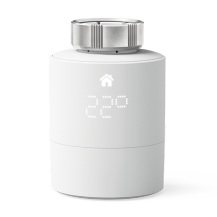

#  MyTado Plugin

Das **MyTado** Plugin ermöglicht es Ihnen, Daten von Ihren Tado- und Tado X-Geräten sowie Wetterinformationen, die von Tado verwaltet werden, abzurufen.

Die Daten werden regelmäßig basierend auf dem von Ihnen ausgewählten aktiven Cron (zwischen 5 und 30 Minuten) aktualisiert.

> **Unterstützte Geräte**
>
> Derzeit werden nur die Modelle BU0X, BP0, BR0X, CK04, RU0X, SU0X, VA0X und WR0X vollständig unterstützt (unabhängig von ihrer Version).
> Wenn ein Gerät nicht unterstützt wird oder ein Problem mit einem der aufgeführten Geräte besteht, folgen Sie bitte den Anweisungen im Abschnitt [Fehlerbehebung](#fehlerbehebung).

# Konfiguration

## Plugin-Konfiguration

1. Gehen Sie zur Plugin-Konfiguration.
2. Installieren Sie die Abhängigkeiten.
3. Starten Sie den Daemon.

Wenn der Daemon nicht startet, könnte der Standardport (59969) bereits verwendet werden. In diesem Fall wählen Sie einen freien Port (z. B. 59970), speichern und starten Sie den Daemon neu. Wenn das Problem weiterhin besteht, konsultieren Sie den Abschnitt [Fehlerbehebung](#fehlerbehebung).

Sie können auch konfigurieren:
- Die Temperatureinheit (Celsius ist standardmäßig eingestellt).
- Die Namenskonvention Ihrer Geräte.
- Die Häufigkeit der Aktualisierungen: Cron 5, 10, 15 oder 30 Minuten (lassen Sie nur einen Cron aktiv). Behalten Sie auch den täglichen Cron bei.

Dann:

1. Schließen Sie die Konfigurationsseite.
2. Klicken Sie auf „Haus hinzufügen“.
3. Geben Sie Ihrem Haus einen Namen (der Name kann sich vom Namen in der Tado-App unterscheiden).
4. Geben Sie den genauen (groß- und kleinschreibungssensiblen) Namen Ihres Hauses in der Tado-App ein.
5. Speichern Sie Ihr Haus.
6. Klicken Sie auf **Mit Tado verbinden** und folgen Sie dem Authentifizierungsprozess.

Sobald die Informationen korrekt sind, werden die Geräte automatisch synchronisiert. Schließen Sie das Haus, um zu überprüfen, ob Ihre Geräte angezeigt werden. Andernfalls aktualisieren Sie die Seite oder prüfen Sie die Logs.

> **INFORMATION**
>
> Wenn Sie sowohl Tado- als auch TadoX-Geräte besitzen, müssen Sie für jedes Ihrer Konten ein Haus erstellen. Alle Geräte werden angezeigt, unabhängig von ihrer Herkunft.

## Geräte-Konfiguration

> **ERINNERUNG**
>
> Verwenden Sie den Befehl **Synchronisierung**, um alle neuen Geräte abzurufen, die Sie hinzugefügt oder die durch ein Plugin-Update neu unterstützt werden.

### Tado-verbundene Geräte

Wenn Sie auf ein Tado-Gerät klicken, gelangen Sie zu:

- **Gerätename**: Basierend auf der Seriennummer und der Zone (standardmäßig können Sie die Namenskonvention in der Plugin-Konfiguration ändern).
- **Elternobjekt**: Festzulegen je nach Ihrer Organisation.
- **Kategorie**: Wählen Sie die Kategorie des Geräts.

Registerkarte **Befehle**:
- Liste der verfügbaren Befehle.
- Möglichkeit zur Historisierung von numerischen Werten.
- Manuelle Aktualisierung möglich mit dem Befehl **Aktualisieren**.

Auf dem Dashboard zeigt das Widget das Bild des Geräts, dessen Informationen und die aktuelle Konfiguration an.

Verfügbare Modi:
- **Autonom**: Nach Tado-Programmierung.
- **Manuell**: Direkte Steuerung der Parameter.
- **Ausgeschaltet**: Das Gerät ist ausgeschaltet.

> **Wichtig:**
> Jede manuelle Temperaturänderung wirkt sich auf *alle* Geräte in derselben Zone aus (Tado-Verhalten).

### Tado-Haus 

Verfügbare Informationen:
- Gerätename
- Elternobjekt
- Kategorie
- Breitengrad / Längengrad (werden für das Wetter verwendet)

Verfügbare Befehle:
- Historisierung von Daten (Wetter und andere)
- Manuelle Aktualisierung möglich (was auch alle Geräte im Haus gleichzeitig aktualisiert)

Das Widget zeigt an: Wetter, Temperatur, Helligkeit, Anwesenheit.

### Tado-Benutzer 

Konfigurierbare Parameter:
- Benutzername
- Elternobjekt
- Kategorie
- Benutzerbild (anpassbar)

Registerkarte **Befehle**: Liste der Befehle, Möglichkeit zur Historisierung.

> **Entfernung vom Haus**:
> - Tado gibt nur eine relative Entfernung zurück (zwischen 0 und 1)
> - Eine Darstellung in km wird von MyTado durchgeführt, dies bleibt jedoch experimentell, da keine Informationen darüber existieren, wie der relative Wert ermittelt wird
> - Gibt **-1** zurück, wenn die Standortfreigabe auf dem Telefon des Benutzers nicht aktiviert ist.

# Szenarien verwalten

Keine besonderen Einschränkungen, außer **für AC-Module**:
Ändern Sie vor der Konfiguration einer Temperatur oder eines Parameters **den AC-Modus** (anders als „Auto“). Andernfalls wird ein Fehler in den Logs angezeigt.

# Fehlerbehebung

1. Stellen Sie die **MyTado**-Logs auf den **Debug-Modus**.
2. Starten Sie den Daemon neu.
3. Überprüfen Sie die Logs, um das Problem zu identifizieren.

Andernfalls konsultieren Sie die [FAQs](#faqs) und zuletzt den Abschnitt [Hilfe anfordern](#hilfe-anfordern).

## FAQs

### Fataler Fehler: [Errno 98] Adresse bereits in Benutzung

Der Kommunikationsport zwischen Ihrem Jeedom und dem Daemon (standardmäßig 59969) ist belegt. Ändern Sie ihn auf einen anderen (z. B. 59970) in der Konfiguration und starten Sie den Daemon neu.

### Token fehlt

Tado hat das aktuelle Token ungültig gemacht. Gehen Sie zu Ihrem Gerätehaus > **Mit Tado verbinden**, um sich erneut zu authentifizieren.

## Hilfe anfordern

1. Überprüfen Sie, ob Ihr Problem bereits in der [Jeedom-Community](https://community.jeedom.com/tag/plugin-mytado) aufgeführt ist.

2. Wenn nicht, erstellen Sie ein neues Thema und geben Sie an:
   - Ihre Jeedom-Konfiguration
   - Die Tado/TadoX-Modelle, die Sie verwenden
   - Die vollständigen **MyTado**- und **MyTado_daemon**-Logs (Dateien anhängen), und stellen Sie sicher, dass sie die Schritte zum Problem enthalten (im Debug-Modus!).

> **Verbergen Sie Ihre persönlichen Daten in den Logs, bevor Sie sie veröffentlichen!**

# Weitere Empfehlungen

1. Hinterlassen Sie eine Bewertung im Markt, wenn Ihnen dieses Plugin gefällt.
2. Schlagen Sie dem Entwickler Verbesserungsideen vor!

---

**Danke, dass Sie das MyTado-Plugin verwenden!**

Ihr Feedback ist wertvoll, um es weiter zu verbessern 😊
