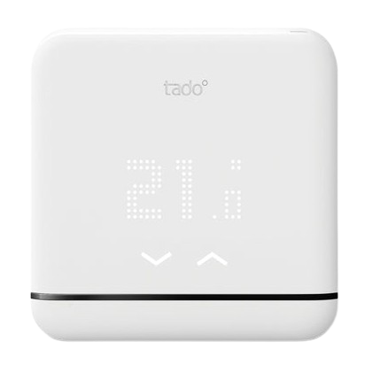
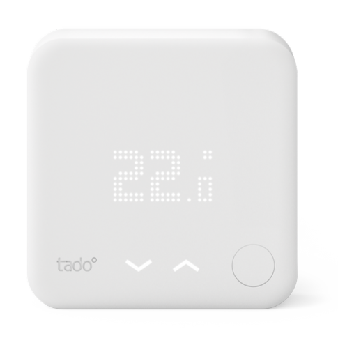
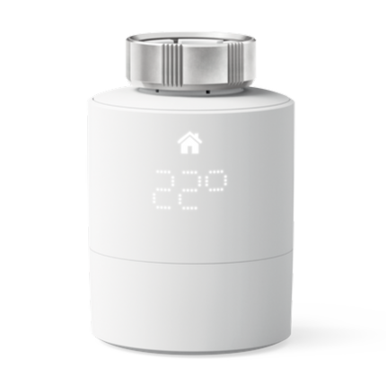
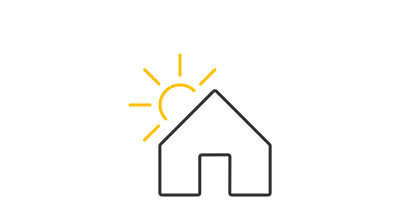

#  Plugin MyTado

The **MyTado** plugin retrieve all your connected object Tado as well as weather data collected by Tado.

Data is refreshed every 30 minutes.

>**Managed devices**
>
>Devices from models AC0X, BU0X, RU0X and VA0X are fully managed (normally whatever version you have). For other models, only basic fonctionalities will be available (access to mesured temperature, enable/disable/auto, data update).
>For any devices not listed, please contact developer specifying what model you have, what functionalities you miss, and whatever extra information you consider relevant.

# Configuration

## Plugin configuration

You must sepcify the 3 following fields:
1) The mail address you used to create your Tado account
2) The password you defined
3) Your exact home name in Tado app (case sensitive)

The temperature unit is optional, **however the plugin uses Celsius by default**.

After configuration saving, please click on **synchronization** button to load all your devices.

## Equipment configuration

>**INFORMATION**
>
>You just have to launch the **Synchronization** command to get all your Tado objets listed as well as the equipment to access weather data collected by Tado.

### Your Tado devices  

While clicking on a Tado object, you will reach its configuration page:

- **Equipment name** : The name of the object based on its serial number.
- **Parent objet** : Shows the parent object your device belongs to. Up to you to define it.
- **Category** : Allows you to choose the category of your equipment.

While clicking on the **Commands** tab, you will find all commands available as welle as the option to historize numerical values.
Your data is updated every 30mn automatically, however you may force the update by using the **refresh** command.

The widget shows the picture of your device as well as its basic data.
You can as well define the mode of your device:
- 'Autonomous': The schedule you defined in teh Tado app is taken into account;
- 'Manual': Allows you to set one or several settings manually depending on the capabilities of your device;
- 'Off': Your device is stopped.

>**Key aspect**
>
>In case of manual setting of the expected temperature, be aware that all your devices part of the same zone will be aligned with this setting (it is how Tado works, no workaround).

### Weather at home 

By clicking on the equipment **Weather at home**, you will reach its configuration page:

- **Equipment name** : The default nme of this equipment.
- **Parent objet** : Shows the parent object your device belongs to. Up to you to define it.
- **Category** : Allows you to choose the category of your equipment.
- **Latitude** : Latitude set at Tado for your home and used to retrieve your weather data.
- **Longitude** : Longitude set at Tado for your home and used to retrieve your weather data.

By clicking on the **Commands** tab, you will find all commands available as well as the option to historize all numerical values and the weather state.
Your data is updated every 30mn automatically, however you may force the update by using the **refresh** command.

The widget shows a picture of the current weather state and shows the actual temperature and solar intensity.
