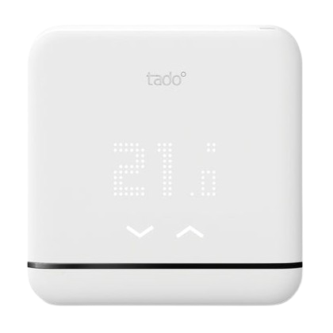

#  Plugin MyTado

El plugin **MyTado** le permite recuperar los datos de sus dispositivos conectados Tado y Tado X, así como la información meteorológica gestionada por Tado.

La actualización de estos datos se realiza de forma regular según el cron activo que seleccione (entre 5 y 30 minutos).

> **Equipos compatibles**
>
> Actualmente, solo los modelos BU0X, BP0, BR0X, CK04, RU0X, SU0X, VA0X y WR0X son totalmente compatibles (independientemente de su versión).
> Para cualquier dispositivo que no esté actualmente soportado, o si tiene problemas con uno de los dispositivos listados, siga las instrucciones en la sección [En caso de problemas](#en-caso-de-problemas).

# Configuración

## Configuración del plugin

1. Vaya a la configuración del plugin.
2. Instale las dependencias.
3. Inicie el demonio.

Si el demonio no se inicia, es posible que el puerto predeterminado (59969) ya esté en uso. En este caso, elija un puerto libre (por ejemplo, 59970), guarde y luego reinicie el demonio. Si el problema persiste, consulte la sección [En caso de problemas](#en-caso-de-problemas).

También puede configurar:
- La unidad de medida de temperatura (Celsius por defecto).
- La convención de nomenclatura de sus dispositivos.
- La frecuencia de actualización: cron cada 5, 10, 15 o 30 minutos (mantenga solo un cron activo). También mantenga el cron diario necesario.

Luego:

1. Cierre la página de configuración.
2. Haga clic en "Añadir una casa".
3. Nombre su casa (el nombre puede ser diferente al de la aplicación Tado).
4. Ingrese el nombre exacto (sensible a mayúsculas y minúsculas) de su casa en la aplicación Tado.
5. Guarde su casa.
6. Haga clic en **Conectarse a Tado** y siga el procedimiento de autenticación.

Una vez que la información sea correcta, los dispositivos se sincronizarán automáticamente. Cierre la casa para verificar que sus dispositivos aparezcan. Si no es así, actualice la página o consulte los logs.

> **INFORMACIÓN**
>
> Si tiene dispositivos Tado y TadoX, deberá crear una casa para cada una de sus cuentas. Todos los dispositivos se mostrarán, independientemente de su origen.

## Configuración de dispositivos

> **RECORDATORIO**
>
> Utilice el comando **Sincronizar** para obtener cualquier nuevo dispositivo que haya agregado o que haya sido añadido gracias a una actualización del plugin.

### Dispositivos Tado conectados

Al hacer clic en un dispositivo Tado, accede a:

- **Nombre del dispositivo**: Basado en su número de serie y zona (por defecto, puede cambiar la convención de nombres en la configuración del plugin).
- **Objeto principal**: Defínase según su organización.
- **Categoría**: Elija la categoría del dispositivo.

Pestaña **Comandos**:
- Lista de comandos disponibles.
- Posibilidad de registrar valores numéricos.
- Actualización manual posible con el comando **Actualizar**.

En el panel de control, el widget muestra la imagen del dispositivo, su información y su configuración actual.

Modos disponibles:
- **Automático**: Según la programación de Tado.
- **Manual**: Control directo de los parámetros.
- **Apagado**: El dispositivo está apagado.

> **Importante:**
> Cualquier cambio manual de temperatura afectará a *todos* los dispositivos de la misma zona (comportamiento de Tado).

### Casa Tado 

Información disponible:
- Nombre del dispositivo
- Objeto principal
- Categoría
- Latitud / Longitud (utilizado para el clima)

Comandos disponibles:
- Registro de datos (clima y otros)
- Actualización manual posible (lo que actualiza todos los dispositivos de la casa al mismo tiempo)

El widget muestra: clima, temperatura, brillo, presencia.

### Usuario Tado 

Parámetros configurables:
- Nombre de usuario
- Objeto principal
- Categoría
- Imagen del usuario (personalizable)

Pestaña **Comandos**: lista de comandos, posibilidad de registro.

> **Distancia desde casa**:
> - Tado solo devuelve una distancia relativa (entre 0 y 1)
> - MyTado realiza una representación en km, pero esto sigue siendo experimental ya que no hay información que indique cómo se obtiene el valor relativo
> - Devuelve **-1** si la ubicación no está activada en el teléfono del usuario.

# Gestionando Escenarios

No hay restricciones particulares, excepto **para los módulos de AC**:
Antes de configurar la temperatura o un parámetro, **cambie el modo del AC** (diferente de "automático"). De lo contrario, aparecerá un error en los logs.

# En caso de problemas

1. Configure los logs de **MyTado** en modo **debug**.
2. Reinicie el demonio.
3. Consulte los logs para identificar el problema.

De lo contrario, consulte las [FAQs](#faqs) y finalmente la sección [Solicitar ayuda](#solicitar-ayuda).

## FAQs

### Error fatal: [Errno 98] Dirección ya en uso

El puerto de comunicación entre su Jeedom y el demonio (por defecto 59969) ya está ocupado. Cámbielo a otro puerto libre (por ejemplo, 59970) en la configuración y reinicie el demonio.

### Token faltante

Tado ha invalidado el token actual. Vaya a su casa de dispositivos > **Conectarse a Tado**, para volver a autenticarse.

## Solicitar ayuda

1. Verifique si su problema ya está publicado en la [Comunidad Jeedom](https://community.jeedom.com/tag/plugin-mytado).

2. Si no, cree un nuevo tema e indique:
   - Su configuración de Jeedom
   - Los modelos Tado/TadoX que está utilizando
   - Los logs completos de **MyTado** y **MyTado_daemon** (adjunte archivos) y asegúrese de incluir los pasos para reproducir el problema (en modo debug).

> **¡Recuerde ocultar sus datos personales en los logs antes de publicarlos!**

# Recomendaciones adicionales

1. Deje una valoración en el Mercado si le gusta este plugin.
2. ¡Proporcione sugerencias de mejora al desarrollador!

---

**¡Gracias por usar el plugin MyTado!**

Su retroalimentación es valiosa para seguir mejorando 😊
