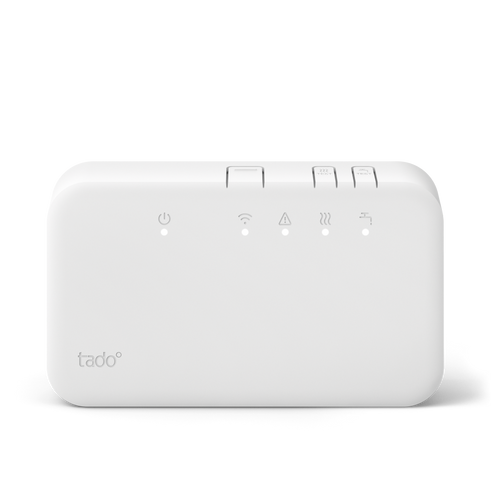
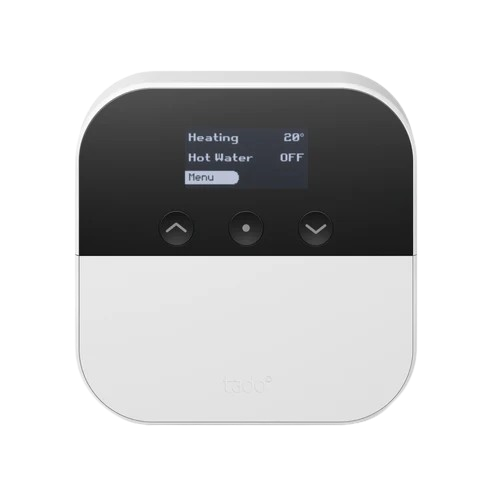

## Español

#  Plugin MyTado

El plugin **MyTado** permite recuperar datos de sus dispositivos conectados Tado y Tado X, así como la información meteorológica gestionada por Tado.

La actualización de estos datos se realiza cada 30 minutos.

>**Dispositivos compatibles**
>
>Actualmente, solo los modelos BU0X, BP0, BR0X, CK04, RU0X, SU0X, VA0X y WR0X están completamente soportados (independientemente de su versión).
>Si encuentra problemas con dispositivos no compatibles o con alguno de los listados, siga las instrucciones en la sección [En caso de problemas](#En-caso-de-problemas).

# Configuración

## Configuración del plugin

Primero, vaya a la configuración del plugin.
Asegúrese de instalar las dependencias y luego iniciar el demonio.
Si no puede iniciar el demonio, es posible que el puerto predeterminado (59969) ya esté en uso.
En ese caso, defina un puerto disponible en la sección de configuración, guarde e intente reiniciar el demonio.
Si el problema persiste, siga las instrucciones en la sección [En caso de problemas](#En-caso-de-problemas).

Opcionalmente, también puede cambiar los siguientes dos parámetros:
1. La unidad de medida de temperatura a mostrar. **Celsius es la unidad predeterminada**.
2. La convención de nomenclatura para sus dispositivos.

Una vez que el demonio esté en funcionamiento, cierre la página de configuración para regresar a la página principal del plugin y siga estos pasos:
1. Haga clic en "Agregar una casa".
2. Asigne un nombre a su casa (el nombre no necesita coincidir con el de Tado), luego haga clic en "Ok".
3. Ingrese la información relacionada con su cuenta Tado:
    - La dirección de correo electrónico utilizada para crear su cuenta en Tado.
    - La contraseña de su cuenta Tado.
    - El nombre exacto (sensible a mayúsculas y minúsculas) de su casa en la aplicación Tado.
4. Guarde su casa.

Si la información es correcta, se agregarán detalles adicionales de su casa, y los dispositivos Tado o TadoX (según su casa) se sincronizarán en unos segundos.
Cierre la casa para verificar si sus dispositivos aparecen.
Si después de unos segundos no pasa nada, actualice la página manualmente.
Si sus dispositivos no aparecen, revise los registros para ver si puede corregir el problema usted mismo.
De lo contrario, siga las instrucciones en la sección [En caso de problemas](#En-caso-de-problemas).

Finalmente, si agrega dispositivos a su casa Tado/TadoX, use el botón **Sincronización** para recuperarlos.

>**INFORMACIÓN**
>
>Si posee dispositivos Tado y TadoX, entonces tiene dos casas. Debe crear una casa para cada una de sus cuentas Tado.
>Todos los dispositivos se listarán, sin importar de qué casa provengan.

## Configuración de dispositivos

>**RECORDATORIO**
>
>Simplemente use el comando **Sincronización** para recuperar cualquier nuevo dispositivo conectado agregado a su casa Tado, o después de una actualización del plugin que permita la compatibilidad con un nuevo tipo de dispositivo que posea.

### Sus dispositivos conectados Tado 

Al hacer clic en un dispositivo conectado Tado, se accede directamente a su página de configuración:

- **Nombre del dispositivo**: Nombre del dispositivo basado en su número de serie.
- **Objeto padre**: Indica el objeto padre al que pertenece el dispositivo. Debe definirlo usted.
- **Categoría**: Permite elegir la categoría del dispositivo.

Al hacer clic en la pestaña **Comandos**, encontrará una lista de todos los comandos disponibles y la posibilidad de historizar los valores numéricos.
Los datos se actualizan cada 30 minutos, pero puede forzar la actualización a pedido con el comando **Actualizar**.

En el panel de control, el widget muestra la imagen correspondiente a su dispositivo, así como la información y configuración actual de sus dispositivos.
También puede definir el modo de funcionamiento de su dispositivo:
- 'Autónomo': Se aplica la programación hecha en la aplicación Tado.
- 'Manual': Ofrece la posibilidad de salir del modo automático y definir el/los parámetro(s) de su elección.
- 'Apagado': El dispositivo está completamente apagado.

>**Información importante**
>
>En caso de un cambio manual de la temperatura deseada, esta se aplicará a todos los dispositivos presentes en la misma zona que su dispositivo (así es como funciona Tado).

### El casa Tado 

Al hacer clic en su casa Tado, se accede directamente a su página de configuración:

- **Nombre del dispositivo**: Nombre que ha dado a su casa en Jeedom.
- **Objeto padre**: Indica el objeto padre al que pertenece el dispositivo. Debe definirlo usted.
- **Categoría**: Permite elegir la categoría del dispositivo.
- **Latitud**: Latitud referenciada en Tado para su casa y utilizada para recuperar el clima correspondiente.
- **Longitud**: Longitud referenciada en Tado para su casa y utilizada para recuperar el clima correspondiente.

Así como su información de inicio de sesión de Tado para esta casa (¡no olvide cambiar su contraseña aquí si la cambia en el sitio web de Tado!).

Al hacer clic en la pestaña **Comandos**, encontrará una lista de todos los comandos disponibles y la posibilidad de historizar los valores numéricos y el estado meteorológico.
Los datos se actualizan cada 30 minutos, pero puede forzar la actualización a pedido con el comando **Actualizar** (tenga en cuenta que esto obliga a la actualización de los datos meteorológicos así como de todos sus dispositivos pertenecientes a esta casa).

El widget muestra el clima en forma de imagen, así como la temperatura y luminosidad actual.

# En caso de problemas

Contacte al desarrollador especificando los modelos de dispositivos Tado/TadoX que posee, las funcionalidades faltantes y cualquier información que considere útil.
Y no olvide proporcionar los registros del plugin y su demonio (asegurándose de ocultar sus datos personales).