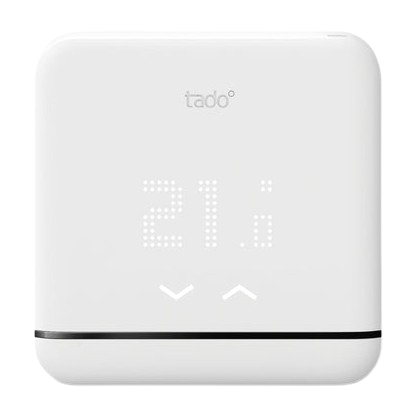
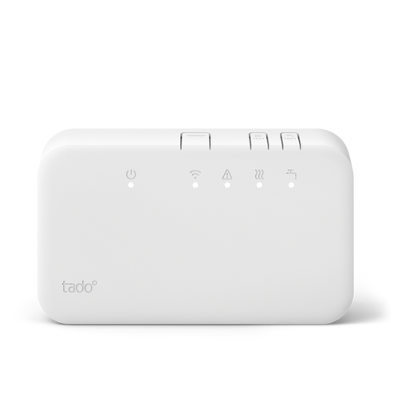
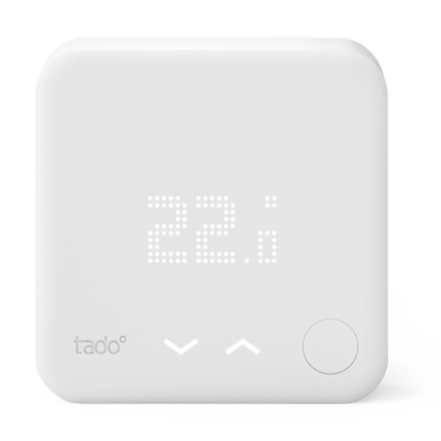
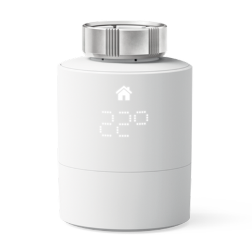
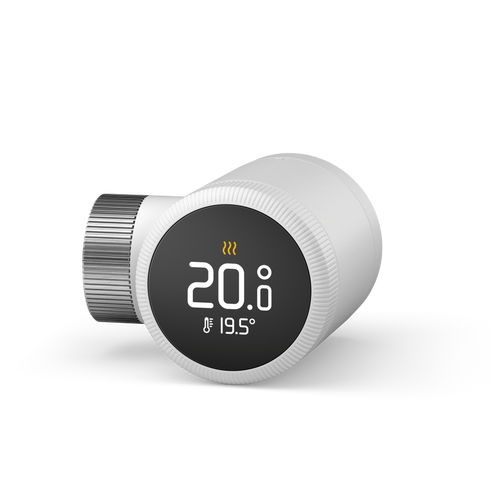
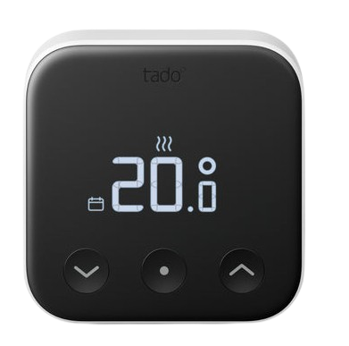
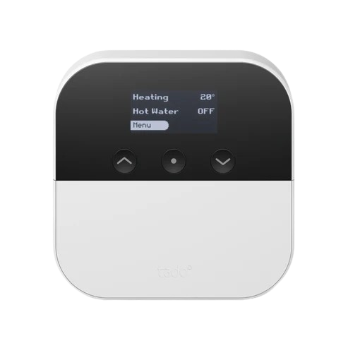
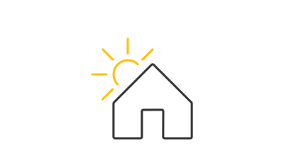

#  Plugin MyTado

Le plugin **MyTado** permet de récupérer les données de vos objets connectés Tado et Tado X ainsi que les informations météo gérées par Tado.

Le rafraîchissement de ces données s’effectue de manière régulière selon votre sélection du cron actif (entre 5mn et 8h).

---

> **Équipements gérés**
>
> Seuls les modèles BU0X, BP0, BR0X, CK04, RU0X, SU0X, VA0X et WR0X sont pleinement pris en charge à ce jour (a priori quelle que soit leur version).
> Pour tout objet non pris en charge actuellement, ou en cas de problème avec l'un de ceux listés, suivez les instructions de la section [En cas de problèmes](#en-cas-de-problèmes).

---

# Configuration

## Configuration du plugin

### Configuration et lancement du démon

1. Allez dans la configuration du plugin.
2. Installez les dépendances.
3. Lancez le démon.

Si le démon ne se lance pas, il se peut que le port par défaut (59969) soit déjà utilisé. Dans ce cas, choisissez un port libre dans la configuration du plugin (ex : 59970), sauvegardez, puis relancez le démon. Si le problème persiste, consultez la section [En cas de problèmes](#en-cas-de-problèmes).

### Configuration du plugin

Tout d'abord, vous pouvez configurer :
- L'unité de mesure de température (Celsius par défaut).
- La convention de nommage de vos objets.

**IMPORTANT**: Tado a introduit de nouvelles limitations API en septembre 2025. Une configuration est maintenant **obligatoire** :
- **Avec Auto-Assist** (abonnement payant Tado) : 20.000 appels API/jour autorisés
- **Sans Auto-Assist** (gratuit) : 100 appels API/jour maximum

En conséquence, voici la configuration du plugin requise:
1. **Sélectionnez votre mode Auto-Assist**: Cela sélectionnera les options idéales pour les paramètres suivants, que vous pouvez tout de même adapter (mais soyez sûrs de ce que vous faites)
2. **Ajustez la fréquence de synchronisation** selon vos besoins :
   - Avec Auto-Assist : synchronisation toutes les 15 minutes recommandée
   - Sans Auto-Assist : synchronisation toutes les heures recommandée (ou moins fréquente)
3. **Activez/désactivez les synchronisations optionnelles** :
   - Synchronisation météo (consomme des appels API)
   - Synchronisation géolocalisation (consomme des appels API)

> **AIDE A LA DECISION** : Le compteur d'appels API
>- Consultez en temps réel votre consommation d'appels API dans la configuration
>- Le compteur se remet à zéro automatiquement chaque jour
>- Des alertes visuelles apparaissent si vous approchez de la limite

> **Action requise** : Si vous n'avez pas encore configuré ces paramètres, une notification apparaîtra dans votre configuration. Configurez ces options pour garantir le bon fonctionnement du plugin.

### Configuration de votre maison

Après sauvegarde de la configuration correcte du plugin (voir ci-dessus) :

1. Fermez la page de configuration.
2. Cliquez sur "Ajouter une maison".
3. Nommez votre maison (le nom peut être différent de celui sur Tado).
4. Saisissez le nom exact (sensible à la casse) de votre maison sur l'application Tado.
5. Sauvegardez votre maison.
6. Cliquez sur **Se connecter à Tado** et suivez la procédure d'authentification.

Une fois les informations correctes, les objets seront synchronisés automatiquement. Fermez la maison pour vérifier que vos objets apparaissent. Sinon, rafraîchissez la page ou consultez les logs.

> **INFORMATION**
>
> Si vous possédez des objets Tado *et* TadoX, vous devez créer une maison pour chacun de vos comptes. Tous les objets seront listés, quelle que soit leur origine.

## Configuration des équipements

> **RAPPEL**
>
> Utilisez la commande **Synchronisation** pour récupérer tout nouvel objet que vous avez ajouté ou nouvellement pris en charge par une mise à jour du plugin.

### Objets connectés Tado

En cliquant sur un objet Tado, vous accédez à :

- **Nom de l’équipement** : Basé sur son numéro de série et sa zone (par défaut, vous pouvez changer la convention de nommage dans la configuration du plugin).
- **Objet parent** : À définir selon votre organisation.
- **Catégorie** : Choisissez la catégorie de l'équipement.

Onglet **Commandes** :
- Liste des commandes disponibles.
- Possibilité d’historiser les valeurs numériques.
- Rafraîchissement possible manuellement avec la commande **Rafraîchir**.

Sur le dashboard, le widget affiche l'image de l'équipement, ses informations et sa configuration actuelle.

Modes disponibles :
- **Autonome** : Suivant la programmation Tado.
- **Manuel** : Contrôle direct des paramètres.
- **Eteint** : L'objet est éteint.

> **Important :**
> Toute modification manuelle de la température affectera *tous* les objets de la même zone (comportement Tado).

### La maison Tado 

Informations disponibles :
- Nom de l'équipement
- Objet parent
- Catégorie
- Latitude / Longitude (utilisées pour la météo)

Commandes disponibles :
- Historisation des données (météo et autres)
- Mise à jour manuelle possible (ce qui met à jour tous les objets de la maison par la même occasion)

Le widget affiche : météo, température, luminosité, présence.

### L'utilisateur Tado 

Paramètres configurables :
- Nom de l’utilisateur
- Objet parent
- Catégorie
- Image de l'utilisateur (personnalisable)

Onglet **Commandes** : liste des commandes, possibilité d’historisation.

> **Distance de la maison** :
> - Tado ne renvoie qu'une distance relative (entre 0 et 1)
> - Une représentation en km est effectuée par MyTado, mais cela reste expérimental comme il n'existe aucun information permettant de définir comment la valeur relative est obtenue
> - Renvoie **-1** si la localisation n’est pas activée sur le téléphone de l'utilisateur.

---

# Gérer des scénarios

Aucune contrainte particulière, sauf **pour les modules AC** :
Avant de configurer une température ou un paramètre, **changez le mode AC** (différent de "auto"). Sinon, une erreur apparaîtra dans les logs.

---

# En cas de problèmes

1. Passez les logs **MyTado** en mode **debug**.
2. Relancez le démon.
3. Consultez les logs pour identifier le souci.

Sinon, consultez les [FAQs](#faqs), et en dernier lieu la section [Demander de l'aide](#demander-de-laide).

## FAQs

### Erreur Fatal: [Errno 98] address already in use

Le port de communication entre votre jeedom et le démon (59969 par défaut) est occupé. Changez-le pour un autre (ex. 59970) dans la configuration, puis relancez le démon.

### Token manquant

Tado a invalidé le token actuel. Allez dans votre équipement maison > **Se connecter à Tado** pour vous réauthentifier.

### Panneaux dépendances et démon vides

Vérifier votre version de Debian. Il faut au minimum Debian 11 (qui déploie PHP 7.4+ et python 3.9+ nécessaires au bon fonctionnement du plugin). Vous devez obligratoirement mettre à jour votre Jeedom.

## Demander de l'aide

1. Vérifiez si votre problème est déjà listé dans la [communauté Jeedom](https://community.jeedom.com/tag/plugin-mytado)

2. Si non, créez un nouveau sujet

3. Dans tous les cas, indiquez :
   - Votre configuration Jeedom
   - Les modèles Tado/TadoX que vous utilisez
   - Les logs complets **MyTado** et **MyTado_daemon** (fichiers attachés), en vous assurant qu'ils contiennent les étapes menant au problème (en mode debug!)

> **Masquez vos données personnelles dans les logs avant de les publier !**

# Autres recommandations

1. Pensez à laisser un avis sur le market si vous aimez ce plugin.
2. Proposez vos idées d'amélioration au développeur !

---

**Merci d'utiliser le plugin MyTado !**

Votre retour est précieux pour continuer à l'améliorer 😊