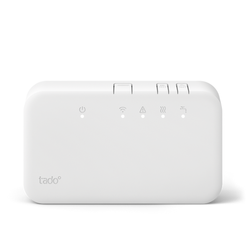
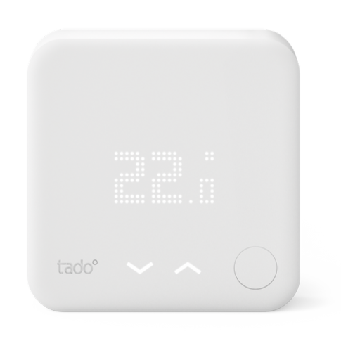
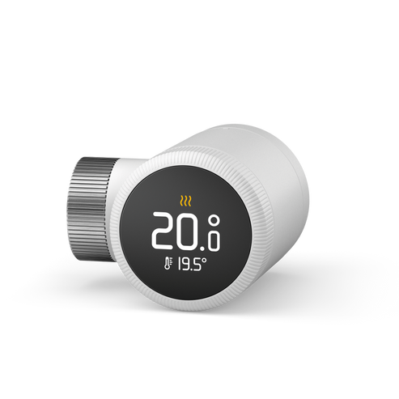
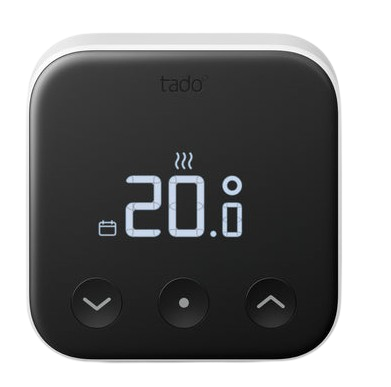
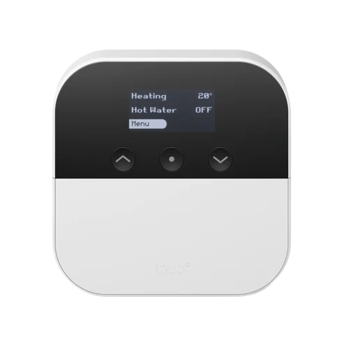
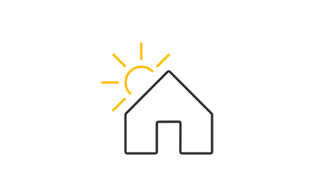

#  Plugin MyTado

Le plugin **MyTado** permet de récupérer les données de vos objets connectés Tado et Tado X ainsi que les infos météo gérées par Tado.

Le rafraîchissement de ces données s’effectue toutes les 30 minutes.

>**Equipements gérés**
>
>Seuls les modèles BU0X, BP0, BR0X, CK04, RU0X, SU0X, VA0X et WR0X sont pleinement pris en charges à ce jour (a priori quel que soit leur version). 
>Pour tout objet non pris en charge à ce jour, voire un soucis avec l'un de ceux listés, suivre les instructions de la partie [En cas de problèmes](#en-cas-de-problèmes).

# Configuration

## Configuration du plugin

Dans un premier temps, allez dans la configuration du plugin.
Assurez vous de lancer l'installation des dépendances, puis du démon.
Si vous n'arrivez pas à lancer le démon, il se peut que le port du démon utilisé par défaut (59969) soit déjà pris. 
Dans ce cas, définissez un port que vous savez disponible dans la partie configuration, sauvez et tentez de relancer le démon.  
Si le problème persiste, suivre les instructions de la partie [En cas de problèmes](#en-cas-de-problèmes).

Si vous le souhaitez, vous pouvez également changer les deux paramètres suivants:
1. L'unité de mesure de température à afficher. **Le Celsius est l'unité par défaut**.
2. La convention de nommage de vos objets qui sera appliquée.
3. Définissez la fréquence de rafraichissement de vos objets en choisissant le cron 5, 10, 15 ou 30 minutes (ne conservez qu'un de ces crons). Conservez le cron journalier qui est nécessaire pour la configuration des objets.

Une fois le démon en marche, fermez la page de configuration pour revenir sur la page principale du plugin, et suivez les étapes suivantes:
1. Cliquez sur "Ajouter une maison"
2. Donnez un nom à votre maison (le nom n'a pas besoin d'être le même que chez Tado), puis cliquer sur "Ok"
3. Saisissez les trois informations liées à votre compte Tado
    - l'adresse mail utilisée pour créer votre compte sur Tado
    - le mot de passe de votre compte Tado
    - le nom exact (sensible à la casse) de votre maison sur l'application Tado
4. Sauvez votre maison

Si les informations saisies sont exactes, les information complémentaires de votre maison seront ajoutées, et les objets Tado our TadoX (selon votre maison) seront synchronisés au bout de quelques secondes.
Fermez la maison pour vérifier que vos objets apparaissent.
Si après quelques secondes rien ne se passe, rafraichissez la page manuellement. 
Si vous n'obtenez pas vos objets, vérifiez les logs afin de voir si vous pouvez corriger un problème remonté par vous-même.
Sinon, suivre les instructions de la partie [En cas de problèmes](#en-cas-de-problèmes).

Enfin, si vous rajoutez des équipements à votre maison Tado/TadoX, le bouton **Synchronisation** est là pour les récupérer.

>**INFORMATION**
>
>Si vous possédez des objets Tado et TadoX, vous avez donc deux maisons. Vous devez alors créer une maison pour chacun de vos comptes Tado.
>Tous les objets seront ainsi listés, peu importe de quelle maison ils viennent.

## Configuration des équipements

>**RAPPEL**
>
>Il suffit d'utiliser la commande **Synchronisation** pour récupérer tout nouvel objet connecté ajouté à votre maison Tado, ou après une mise à jour du plugin qui permettrait la prise en charge d'un nouveau type d'objet que vous possédez.

### Vos objets connectés Tado

En cliquant sur un objet connecté Tado, on arrive directement sur sa page de configuration :

- **Nom de l’équipement** : Nom de l'équipement basé sur son numéro de série.
- **Objet parent** : Indique l’objet parent auquel appartient l’équipement. A vous de le défnir.
- **Catégorie** : Permet de choisir la catégorie de l'équipement.

En cliquant sur l'onglet **Commandes**, on retrouve la liste de toutes les commandes disponibles ainsi que la possibilité d’historiser les valeurs numériques.
Les données sont mises à jour toutes les 30mn, mais vous pouvez forcer la mise à jour à la demande avec la commande **Rafraîchir**.

Dans le dashboard, le widget affiche l'image correspondant à votre équipement ainsi que les informations et configurations actuelles de vos équipements.
Vous pouvez également définir le mode de fonctionnement de votre objet:
- 'Autonome': La programmation faite sur l'appli Tado est prise en compte;
- 'Manuel': Offre la possibilité de sortir du mode automatique et de définir le ou les paramètre(s) de votre choix;
- 'Eteint': L'objet est totalement éteint.

>**Information importante**
>
>Dans le cas d'un changement manuel de la température désirée, cette dernière sera appliquée à tous les objets présents dans la même zone que votre objet (c'est ainsi que fonctionne Tado). 

### La maison Tado 

En cliquant sur votre maison Tado, on arrive directement sur sa page de configuration :

- **Nom de l’équipement** : Nom que vous avez donné à votre maison sur jeedom.
- **Objet parent** : Indique l’objet parent auquel appartient l’équipement. A vous de le défnir.
- **Catégorie** : Permet de choisir la catégorie de l'équipement.
- **Latitude** : Latitude référencée sur Tado pour votre maison et utilisée pour récupérer la météo correspondante.
- **Longitude** : Longitude référencée sur Tado pour votre maison et utilisée pour récupérer la météo correspondante.

Ainsi que vos informations de connexion à Tado pour cette maison (n'oubliez pas de changer votre mot de passe ici si vous êtes amené à le changer sur le site Tado!).

En cliquant sur l'onglet **Commandes**, on retrouve la liste de toutes les commandes disponibles ainsi que la possibilité d’historiser les valeurs numériques ainsi que l'état météorologique.
Les données sont mises à jour toutes les 30mn, mais vous pouvez forcer la mise à jour à la demande avec la commande **Rafraîchir** (notez que cela force la mise à jour des données de météo mais également de tous vos objets appartenant à cette maison).

Le widget affiche le temps qu'il fait sous forme d'image ainsi que la température, la luminosité actuelle et les personnes présentes à la maison.

### L'utilisateur Tado 

En cliquant sur un utilisateur Tado, on arrive directement sur sa page de configuration :
- **Nom de l’équipement** : Nom que vous avez donné à la personne sur jeedom (par défaut, le nom défini sur Tado apparaîtra).
- **Objet parent** : Indique l’objet parent auquel associer l'utilisateur. A vous de le défnir.
- **Catégorie** : Permet de choisir la catégorie de l'équipement.
- **Changer l'image** : Permet de choisir une photo pour personnaliser l'identification de l'utilisateur dans la liste de objets et la présence sur le widget *maison*.

En cliquant sur l'onglet **Commandes**, on retrouve la liste de toutes les commandes disponibles ainsi que la possibilité d’historiser les valeurs obtenues.

# Gérer des scénarios

Il n'y a pas de contraintes particulières dans l'utilisation des actions au sein de vos scénarios. 
A l'exception des actions de configuration des modules type AC.
En effet, dans ce cas-là, il faudra toujours d'abord passer dans un mode AC différent de "auto" avant de définir une température désirée (et probablement d'autres paramètres).
Dans le cas contraire, vous obtiendrez une erreur dans les logs vous informant de cette contrainte.

# En cas de problèmes

Contactez le développeur en spécifiant les modèles d'objet Tado/TadoX que vous avez, les fonctionalités manquantes ou présentant un disfonctionnement, ainsi que toute information que vous jugerez utile. 
Et n'oubliez pas de fournir les logs du plugin et de son démon (en prenant garde de masquer vos données personnelles).